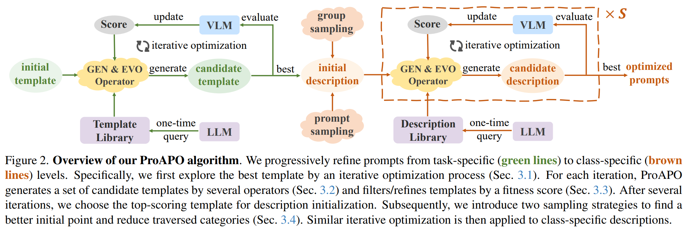

# ProAPO: Progressively Automatic Prompt Optimization for Visual Classification

* Official PyTorch implementation for paper [**ProAPO: Progressively Automatic Prompt Optimization for Visual Classification**](https://arxiv.org/abs/2502.19844).
* The paper is accepted by CVPR 2025

## Introduction 
Vision-language models (VLMs) have made significant progress in image classification by training with large-scale paired image-text data. Their performances largely depend on the prompt quality. While recent methods show that visual descriptions generated by large language models (LLMs) enhance the generalization of VLMs, class-specific prompts may be inaccurate or lack discrimination due to the hallucination in LLMs. In this paper, we aim to find visually discriminative prompts for fine-grained categories with minimal supervision and no human-in-the-loop. An evolution-based algorithm is proposed to progressively optimize language prompts from task-specific templates to class-specific descriptions. Unlike optimizing templates, the search space shows an explosion in class-specific candidate prompts. This increases prompt generation costs, iterative times, and the overfitting problem. To this end, we first introduce several simple yet effective edit-based and evolution-based operations to generate diverse candidate prompts by one-time query of LLMs. Then, two sampling strategies are proposed to find a better initial search point and reduce traversed categories, saving iteration costs. Moreover, we apply a novel fitness score with entropy constraints to mitigate overfitting. 

<div align="center">
  
</div>

<div align="center">
  
</div>

## Environment Setup

We recommend to install the environment through conda and pip. You should make a new environment with python>=3.9
```bash
conda create -n python_ProAPO python=3.9
```

Next, you can download pytorch from official site, for example:
```bash
conda install pytorch torchvision torchaudio cudatoolkit=11.3 -c pytorch
```
Next, run 
```bash
pip install -r requirements.txt
```
in this repo to install a few more packages required by CLIP.

## Dataset Installation

Please follow [DATASET.md](https://github.com/KaiyangZhou/CoOp/blob/main/DATASETS.md) to download official ImageNet and other 10 datasets in CoOp.
Except datasets in CoOp, we also consider the [CUB](https://www.vision.caltech.edu/datasets/cub_200_2011/) and [Places](http://places2.csail.mit.edu/) datasets.

## Get Started

We provide `ATO.sh` and `ProAPO.sh` which you can run ATO and ProAPO in an one-line command on ResNet50 or ViT-B/32 backbones.
```bash
sh run/ATO_RN50.sh
sh run/ATO_ViT-B-32.sh
```
```bash
sh run/ProAPO_RN50.sh
sh run/ProAPO_ViT-B-32.sh
```
Notably, you need to set `--data_root` and `--checkpoint_path` to your paths.


## Acknowledgement 

This repo benefits from [DCLIP](https://github.com/sachit-menon/classify_by_description_release), [CuPL](https://github.com/sarahpratt/CuPL), [WaffleCLIP](https://github.com/ExplainableML/WaffleCLIP), [AdaptCLIP](https://github.com/cvl-umass/AdaptCLIPZS), [GPT4Vis](https://github.com/whwu95/GPT4Vis), [iCM](https://github.com/zhuole1025/LLMs_as_Visual_Explainers), and [PN](https://github.com/shihongl1998/LLM-as-a-blackbox-optimizer). Thanks for their work.

## Reference

```
@inproceedings{Visual_in_context_learn,
  author       = {Xiangyan Qu and Gaopeng Gou and Jiamin Zhuang and Jing Yu and Kun Song and Qihao Wang and Yili Li and Gang Xiong},
  title        = {ProAPO: Progressively Automatic Prompt Optimization for Visual Classification},
  booktitle    = {CVPR},
  publisher    = {{IEEE}},
  year         = {2025},
}
```
